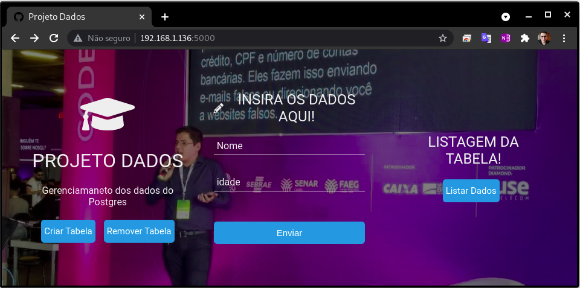
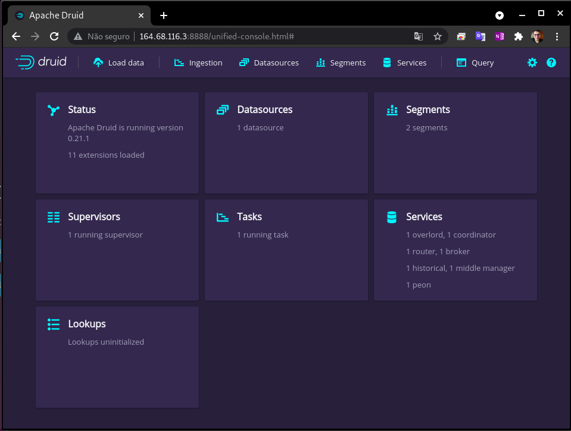
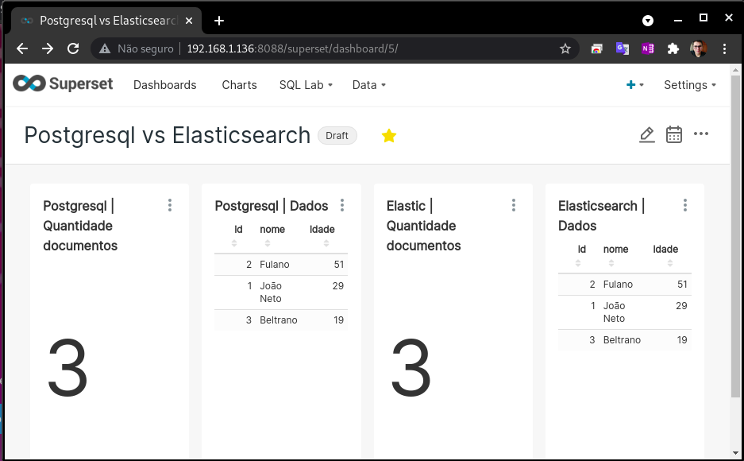

<h4 align="center"> 
	🚧 Projeto para análise de dados 1.0 🚀 em construção... 🚧
</h4>

# Projeto Análise de dados 🔥

## 💻 Sobre o projeto

Nesse projeto será demonstrado como criar uma pipelines para ingestão, processamento, análise e consumo de dados utilizando algumas das soluções mais utilizadas no mercado atualmente. Para isso utilizaremos:
- Python Flask (Aplicação principal que será acessada pelos usuários finais)
- PostegreSQL (Banco de dados que receberá os dados da aplicação)
- Debezium (Aplicação responsável por coletar os dados do banco de dados e enviar para um tópico do Kafka)
- Apache Kafka (Camada de fila de dados/eventos)
- Apache Flink (Enriquecimento e validação de dados)
- Apache Druid (Agregação e Armazenamento)
- Elasticsearch (Motor de busca/Armazenamento)
- Aplicação Python Consumer (Aplicação responsável por ler os eventos do Kafka e enviar para o Elasticsearch)
- Apache Superset (Painel analítico para monitoramento do fluxo de dados)
- Docker (Gestão dos containers do projeto)

### Diagrama v1


### Web

Exemplo da página Web que fará a comunicação com o PostgreSQL



Referência do código: [W3Docs](https://www.w3docs.com/tools/editor/5795)

## 🛠 Tecnologias

As seguintes ferramentas foram usadas na construção do projeto:

- [Python Flask][flask]
- [PostgreSQL][postgresql]
- [Debezium][debezium]
- [Apache Kafka][kafka]
- [Apache Flink][flink]
- [Apache Druid][druid]
- [Elasticsearch][elasticsearch]
- [Aplicação Python Consumer][python-kafka]
- [Apache Superset][superset]
- [Docker][Docker]

### Pré-requisitos

Antes de começar, você vai precisar ter instalado em sua máquina as seguintes ferramentas:

- [Docker][Docker]
- Docker-compose versão 1.29.2 - [How to](https://docs.docker.com/compose/install/)
- Além disto é bom ter um editor para trabalhar com o código como [VSCode][vscode], apesar de não ser obrigatório.

## 🚀 Como executar o projeto

1. Clone o repositorio projeto-dados e crie a rede de comunicação interna dos containers

    ```bash
    $ git clone https://github.com/j040n3t0/projeto-dados.git
    $ docker network create custom_network
    ```

2. Execute o compose da pasta projeto-dados/flask_postgresql

    ```bash
    $ cd projeto-dados/flask_postgresql
    $ docker-compose up
    ```

    Feito isso você já conseguirá acessar a página do frontend no seguinte endereço: **http://SEU_IP:5000**

    **Troubleshoot**

    Referências:
    - wal_level [Must be Logical](https://stackoverflow.com/questions/59416301/how-to-change-postgres-docker-image-wal-level-on-setup)
    - Captcha [codepen](https://codepen.io/manishjanky/pen/eRNKLL)
    

3. Execute o compose da pasta debezium_kafka

    ```bash
    $ cd projeto-dados/debezium_kafka
    $ docker-compose up
    $ curl -i -X POST -H "Accept:application/json" -H "Content-Type:application/json" localhost:8083/connectors/ -d @./postgresql-connect.json
    ```

    Nesse ponto foi criado o conector (Debezium) que enviará os dados do PostgreSQL para o tópico **fullfillment.public.inventory** no Kafka

    **Troubleshoot**

    Referência: https://stackoverflow.com/questions/62150625/couldnt-read-data-from-json-config-file-using-curl

4. Apache Flink

    🚧 Pendente! 🚧

5. Elasticsearch / python engine

    ```bash
    $ cd projeto-dados/elastic_pythonConsumer
    $ mkdir elastic-data
    $ docker-compose up
    ```

    Nessa etapa do projeto o container do Python já deverá estar lendo do tópico **fullfillment.public.inventory** no Kafka e enviando os dados para o Elasticsearch! O elasticsearch estará acessível no seguinte endereço: **http://SEU_IP:9200**

6. Druid

    ```bash
    $ cd projeto-dados/apache_druid
    $ docker-compose up
    ```

    

7. Superset

    ```bash
    $ cd projeto-dados/apache_superset
    $ docker-compose -f docker-compose-non-dev.yml up
    # Esse plugin é necessário para permitir que o superset conecte em bases Elasticsearch
    $ docker exec <id/nomecontainer> bash -c "pip install elasticsearch-dbapi"
    ```

    Nessa etapa do projeto você tem a integração completa de todos os componentes abordados anteriormente! O Superset estará acessível no seguinte endereço: **http://SEU_IP:8088** com usuário **admin** e senha **admin**. 
    
    Agora é só se divertir analisando seu ambiente e montando Dashboards comparativas com o Superset, como no exemplo abaixo podemos ver se as bases de dados do (Cache) Elasticsearch e (BD Prod) PostgreSQL estão com os mesmo registros.

    


## 💡 Ideias de melhorias

- [X] Colocar captcha para evitar engraçadinhos
- [X] Limitar a listagem dos registros aos últimos 10
- [ ] Colocar todos os serviços na mesma rede, isso evitará publicar portas desnecessárias
- [ ] Serviços que não possuem senha, adicionar camada de autenticação (Nginx)
- [ ] Padronizar nome dos containers
- [ ] Remover/alterar senhas padrões

## 🧠 Idealizadores

Responsáveis pelo projeto:
- João Neto [joaojose.ti@gmail.com]

## 😯 Como contribuir para o projeto

👋🏽 [Entre em contato!](https://t.me/j040n3t0)

<!-- ## 📝 Licença -->


<h4 align="center"> 
	🚧 Projeto para análise de dados 1.0 🚀 em construção... 🚧
</h4>

[vscode]: https://code.visualstudio.com/
[docker]: https://www.docker.com/
[flask]: https://flask.palletsprojects.com/en/2.0.x/
[postgresql]: https://www.postgresql.org/
[debezium]: https://debezium.io/
[kafka]: https://kafka.apache.org/
[flink]: https://flink.apache.org/
[druid]: https://druid.apache.org/
[superset]: https://superset.apache.org/
[elasticsearch]: https://www.elastic.co/pt/what-is/elasticsearch
[python-kafka]: https://github.com/dpkp/kafka-python