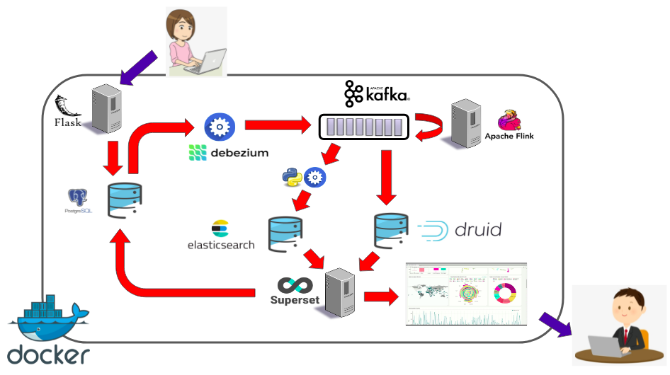

<h4 align="center"> 
	🚧 Projeto para análise de dados 1.0 🚀 em construção... 🚧
</h4>

# Projeto Análise de dados 🔥

## 💻 Sobre o projeto

Nesse projeto será demonstrado como criar uma pipelines para ingestão, processamento, análise e consumo de dados utilizando algumas das soluções mais utilizadas no mercado atualmente. Para isso utilizaremos:
- Python Flask (Aplicação principal que será acessada pelos usuários finais)
- PostegreSQL (Banco de dados que receberá os dados da aplicação)
- Debezium (Aplicação responsável por coletar os dados do banco de dados e enviar para um tópico do Kafka)
- Apache Kafka (Camada de fila de dados/eventos)
- Apache Flink (...)
- Apache Druid (Agregação e Armazenamento)
- Elasticsearch (Motor de busca/Armazenamento)
- Aplicação Python Consumer (Aplicação responsável por ler os eventos do Kafka e enviar para o Elasticsearch)
- Apache Superset (Painel analítico para monitoramento do fluxo de dados)
- Docker (Gestão dos containers do projeto)

### Diagrama v1


### Web
<h4 align="center">
    🚧 Em construção... 🚧
    Tela de demonstração do mecanismo de busca
</h4>

## 🛠 Tecnologias

As seguintes ferramentas foram usadas na construção do projeto:

- [Python Flask][flask]
- [PostegreSQL][postgresql]
- [Debezium][debezium]
- [Apache Kafka][kafka]
- [Apache Flink][flink]
- [Apache Druid][druid]
- [Elasticsearch][elasticsearch]
- [Aplicação Python Consumer][python-kafka]
- [Apache Superset][superset]
- [Docker][Docker]

### Pré-requisitos

Antes de começar, você vai precisar ter instalado em sua máquina as seguintes ferramentas:

- [Docker][Docker]
- Além disto é bom ter um editor para trabalhar com o código como [VSCode][vscode], apesar de não ser obrigatório.

## 🚀 Como executar o projeto

1. Clone o repositorio projeto-dados

2. Execute o compose da pasta projeto-dados/flask_postgresql

    **Troubleshoot**

    Referência: wal_level [Must be Logical](https://stackoverflow.com/questions/59416301/how-to-change-postgres-docker-image-wal-level-on-setup)

3. Execute o compose da pasta debezium_kafka
    * criar arquivo de configuração do Kafka Connect: postgresql-connect.json
    * ```$ curl -i -X POST -H "Accept:application/json" -H "Content-Type:application/json" localhost:8083/connectors/ -d @./postgresql-connect.json ```

    **Troubleshoot**

    Referência: https://stackoverflow.com/questions/62150625/couldnt-read-data-from-json-config-file-using-curl

4. Apache Flink
5. Elasticsearch / python engine
6. Druid
7. Superset


### 🎲 Rodando o Backend (Servidor Dev)

```bash
# Escrever aqui os comandos para replicar o projeto
```

### 🧭 Rodando a aplicação web (Front End)

🚧 Em construção... 🚧

## 🧠 Idealizadores

Responsáveis pelo projeto:
- João Neto [joaojose.ti@gmail.com]

## 😯 Como contribuir para o projeto

👋🏽 [Entre em contato!](https://t.me/j040n3t0)

<!-- ## 📝 Licença -->


<h4 align="center"> 
	🚧 api-note-elasticStack 1.0 🚀 em construção... 🚧
</h4>

[vscode]: https://code.visualstudio.com/
[docker]: https://www.docker.com/
[flask]: https://flask.palletsprojects.com/en/2.0.x/
[postgresql]: https://www.postgresql.org/
[debezium]: https://debezium.io/
[kafka]: https://kafka.apache.org/
[flink]: https://flink.apache.org/
[druid]: https://druid.apache.org/
[superset]: https://superset.apache.org/
[elasticsearch]: https://www.elastic.co/pt/what-is/elasticsearch
[python-kafka]: https://github.com/dpkp/kafka-python